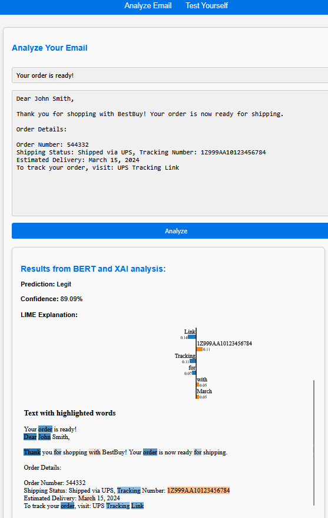
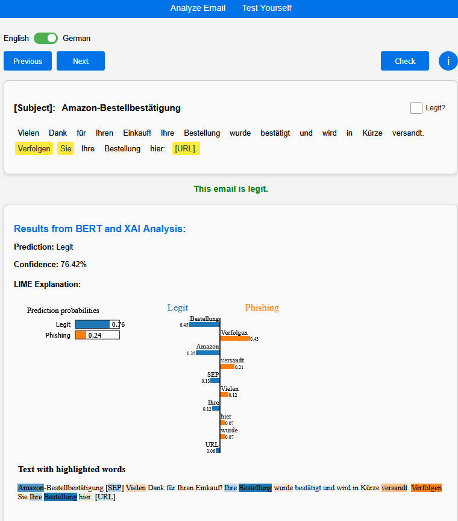

# Phishing BERT

This project focuses on detecting phishing emails using **BERT-based text classification** and using **meta-feature-based machine learning models** as baseline models for comparison. 
It includes the process of data collection, preprocessing, training, evaluation, and explainability, providing the user with a Web UI to analyze their own mails.

---

## Project Structure

```
app/
  ├── static/
  │   ├── css/                # CSS stylesheets
  │   ├── csv/                # Email datasets
  │   ├── images/             # UI images (e.g., favicon, spinner)
  │   ├── js/                 # JavaScript files
  │   ├── json/               # LIME explanations
  ├── templates/
  │   ├── index.html          # Main webpage
  │   ├── learn_phishing.html # Learn phishing detection
  ├── app.py                  # Flask app for real-time email analysis

data/
  ├── raw/                    # Raw email datasets
  ├── preprocessed/           # Processed datasets (BERT, Meta features)

models/
  ├── bert/                   # Trained BERT models
  ├── meta/                   # Machine learning models for meta-features

src/
  ├── data_preparation/       # Data preprocessing scripts
  ├── helper_functions/       # Utility functions
  ├── model_training/         # Training scripts for BERT & Meta models
  ├── XAI/                    # Explainability methods (LIME)

```

## Installation

### **1. Clone the Repository**
```
git clone https://github.com/your-repo/phishing-detection.git
cd phishing-detection
```

### **2. Create Virtual Environment**
```
python -m venv venv
source venv/bin/activate  # On Windows: venv\Scripts\activate
```

### **3. Install Dependencies**
```
pip install -r requirements.txt
```

### **4. Download Models**
Download the models from the following [Google Drive link](https://drive.google.com/file/d/1zMR88hDkT9qJZwvL5cewcMQqdDn5v2ZX/view?usp=sharing) and place the folder in the root directory.


### **5. Run app.py**
```
cd path/to/project/root
python app/app.py
```

After running app.py, the local development server will start, typically accessible at http://127.0.0.1:5000. You’ll see two main tabs: Analyze Email and Test Yourself

- **Analyze Email (left)**  
  This page lets you input a subject and body. By clicking Analyze, the predicted label (Phishing/Legit), the confidence score, and the LIME explanation are shown.

- **Test Yourself (right)**  
  On this page, sample emails are shown. You can guess whether it’s phishing or legitimate, and then see how the model classified it — along with a token-level explanation showing which words were most influential. The samples can be shown in English and German (the respective German / English BERT model was used for the predictions). The instructions can be looked at at any time, by clicking on the information icon (i).

<div style="display: flex; justify-content: center; gap: 10px;">
    
    
</div>


##  Features

### **1. Email Data Collection**
- **IMAP Email Extraction** (`data_collect.py`)
- Fetches emails from user inbox and spam folders.
- Auto-labels emails based on known senders and domains.

### **2. Data Preprocessing**
- Prepare BERT Input (`prepare_bert_data.py`)
- Meta-feature Extraction (`prepare_meta_data.py`)
- Dataset Balancing & Augmentation (`data_assembly.py`)

### **3. Model Training & Evaluation**
- BERT Model for Email Classification (`bert.py`)
- Meta-Feature-Based Models (Naive Bayes, Logistic Regression, Decision Trees, Random Forest, Ensemble) (`meta.py`)
- Evaluation Metrics & Plots (`bert_eval.py`, `meta_eval.py`)

### **4. Explainability (XAI)**
- LIME & IG-Based Explanations for Predictions (`explain_bert.py`)
- Generating Explanations for Predictions with CSV (`explain_bert.ipynb`)

### **5. Web Interface (Flask App)**
- Real-time Email Analysis
- Interactive Phishing Learning Module
- XAI Visualization
---

